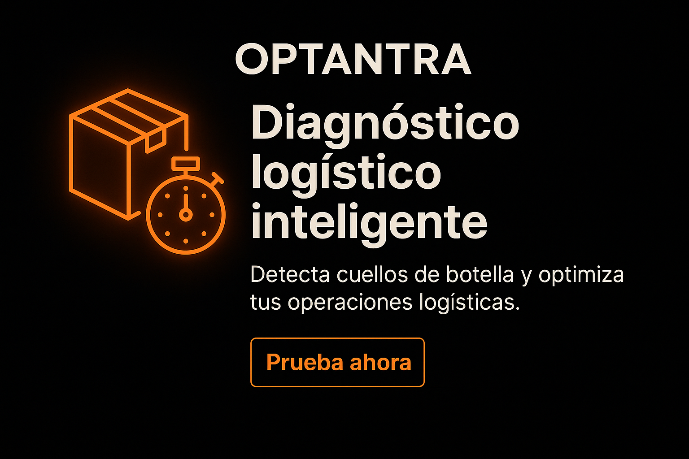

[](https://optantra.streamlit.app/)





# 🚛 Optantra – Diagnóstico logístico inteligente

> 📊 Plataforma inteligente para detectar cuellos de botella y sugerir acciones correctivas en procesos logísticos clave.

---

## 🧠 ¿Qué es Optantra?

Optantra es una app creada con [Streamlit](https://streamlit.io/) que permite:
- Diagnosticar problemas en procesos logísticos críticos
- Identificar urgencia y descripción del problema
- Generar sugerencias automáticas para optimizar operaciones

---

## 🧩 Procesos incluidos

- ✅ Recibo y entrada de mercancía  
- ✅ Control y planeación del inventario  
- ✅ Compras y gestión de proveedores  
- ✅ Alistamiento y despacho de pedidos

---

## ⚙️ Tecnologías utilizadas

- Python 🐍  
- Streamlit 🎈  
- Git + GitHub 🔧  
- Google Colab ☁️ (para desarrollo)

---

## 🚀 ¿Cómo ejecutar la app?

### ✅ Opción 1: Usar la app en línea

👉 [Haz clic aquí para abrir Optantra](https://optantra.streamlit.app/)

> Funciona en navegador, sin necesidad de instalar nada.

---

### 🧪 Opción 2: Ejecutar localmente

```bash
git clone https://github.com/maicolvb/optantra_v1.git
cd optantra_v1
pip install -r requirements.txt
streamlit run optantra.py


---

## 📈 Ejemplo de uso

1. Selecciona el proceso que presenta problemas  
2. Describe el problema  
3. Selecciona el nivel de urgencia  
4. ¡Obtén una sugerencia automática!

---

## 📩 Contacto

¿Comentarios o ideas?  
📧 maicol.virguez.buitrago@gmail.com  
📍 Colombia | 💻 GitHub: [@maicolvb](https://github.com/maicolvb)

